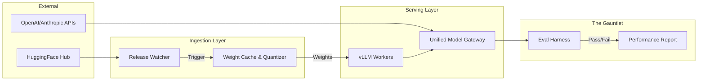

# Rapid Evaluation & Deployment Pipeline

## 1. Architecture

We need a single entry point for all LLM interactions. Whether the backend is an H100 cluster running Llama or an API call to the Claude models, the user experience should be identical.

- **Proprietary Models:** lightweight proxy (LiteLLM or a custom Rust service) to manage auth, logging and cost/token tracking.
- **Open Weights:** We need a serving engine to deploy open-source models. vLLM is currently the best option available, so the following strategy should be implemented:

    1. maintain a container image that pulls the latest vLLM nightly. When a new model drops, we try to load it here first.
    2. If vLLM fails (custom GPU kernels, weird attention mechanism), we fall back to a raw PyTorch/HuggingFace Transformers container. It will be slower but will meet the 24 hour requirement while we wait for the kernel optimizations to land.

We also need a service (Watcher) to automatically detect new model drops:
- **HuggingFace API:** Checks for new repositories from whitelisted organizations (e.g., `meta-llama`, `mistralai`) every 10 minutes.
- **GitHub Releases:** Monitors key repositories for framework updates that might be needed for the new models.
- **Alerting:** Pings a dedicated Slack channel / email alert, triggers CI/CD pipeline.

## 2. Workflow

When a new model drops:
1.  **Proprietary Models:** We add the API key and model ID to the Gateway config. It becomes instantly available for evals.
2.  **Open Weights:** The Watcher detects the release and triggers the CI/CD job. It pulls the weights to a shared high-performance filesystem (e.g. Lustre), attempts a dry run load with vLLM, and if successful, exposes it on a private endpoint.
3. **Automated Evals (Gauntlet)** To evaluate the model, we create an automated evaluation suite (Gauntlet) that runs immediately after deployment.

Note: In my experience, it's best to avoid public benchmarks and instead craft a small internal dataset of challenging questions (problems that are of interest to users), then run these and a human (or a trusted older model) does the eval. Along with the perfomance check, we should also include:

1.  **Sanity Check:** Does it output valid English? Does it respect stop tokens?
2.  **Compliance Check:** If asked for insider info, does it refuse?

If a model passes the Gauntlet, it is automatically promoted to the `preview` tag in the Gateway, accessible to developers across the organization.

## 3. Timeline

| Phase | Duration | Deliverable |
| :--- | :--- | :--- |
| **Phase 1** | Weeks 1-2 | Deploy LiteLLM. Connect existing APIs. Standardize auth. |
| **Phase 2**| Weeks 3-6 | Setup K8s. Get vLLM running. Benchmark throughput on H100s. |
| **Phase 3** | Weeks 6-8 | Build the internal eval dataset. Automate the "New Model" trigger. |

## 4. Challenges & Risks

*   **Bleeding Edge Tax:** New models often require patched versions of transformers or vLLM. We might need to fork these repos temporarily to support a new architecture on Day 0.
*   **GPU Scarcity:** If we want to run a 400B+ model, we need multi-node inference. If our cluster is full, we need a preemption strategy (kill the research jobs to host the new model).
*   **Quantization Latency:** Quantizing a 70B model to FP8 or AWQ takes time. On Day 0, we might have to serve BF16 (full weight) which is expensive, then swap to quantized versions on Day 2.

