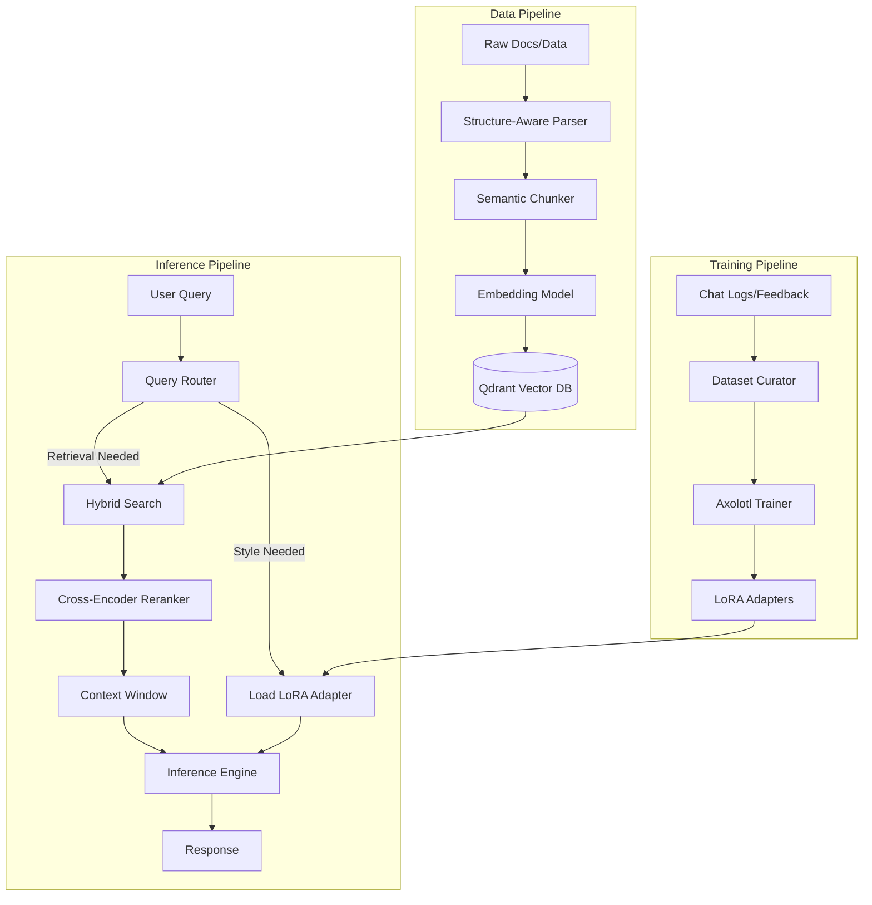

# RAG & Fine-Tuning

## 1. Architecture: RAG

Vanilla RAG rarely works in the real world where data is messy. We need infrastructure that respects the structure of complex financial data.

### Storage Layer
In my experience, a three-tier storage layer ensures the best performance:
-   **Vector Store:** **Qdrant**. Written in Rust, fast, and handles payload filtering exceptionally well.
-   **Hot Storage:** **Redis**. For caching frequent queries.
-   **Source of Truth:** **Postgres**. We store the original text chunks here. The vector DB is just an index.

### Retrieval Engine
On top of vanilla similarity search, we also .
1.  **Hybrid Search:** We combine dense retrieval (embeddings) with sparse retrieval (BM25/Splade).
2.  **Reranking:** We use a cross-encoder (like bge-reranker) to re-score the top 50 results. This is the single biggest quality boost you can get.
3. **HyDE:** Hypothetical Document Embeddings can be very useful in retrieving information when the query does not really match the embedded documents.

### Ingestion
We build a custom ingestion pipeline (using Unstructured or lamaParse) available to users via endpoint. One key point here is to ensure we preserve the structure of data, i.e. we save tables as HTML or Markdown.

## 2. Architecture: Fine-Tuning

Instead of deploying several specialized models, we deploy one base model and swap LoRA adapters dynamically. Examples of specialized adapters we can build:
-   `adapter_compliance`: Checks for regulatory issues.
-   `adapter_sql`: Specialized in our internal DB schema.
-   `adapter_earnings`: Tuned on years of earnings calls to extract sentiment.

For the deployment I would recommend:
-   **Orchestration:** **Ray Train** on Kubernetes, it handles the distributed training.
-   **Configuration:** **Axolotl**. It abstracts away the PyTorch/HuggingFace boilerplate. We define a YAML config, point it to our S3 bucket, and it spits out LoRA adapters.
-   **Tracking:** **MLFlow** or **Weights & Biases** (self-hosted).

## 3. Workflow

## 4. Timeline

| Phase | Duration | Deliverable |
| :--- | :--- | :--- |
| **Phase 1** | Weeks 1-4 | Deploy Qdrant. Build ingestion pipeline. |
| **Phase 2** | Weeks 4-8 | Setup Axolotl on K8s. Train the first adapter. |
| **Phase 3** | Weeks 8-12 | Connect user feedback (thumbs up/down) to the training dataset. |

## 5. Challenges & Risks

*   **Lost in the Middle:** LLMs are bad at using information in the middle of a long context window. We need to be aggressive with reranking to put the best info at the start/end.
*   **Table Retrieval:** RAG tends to underperform at complex data structures like tables. We might need a specialized "Text-to-SQL" path for structured data instead of embedding it.
*   **Catastrophic Forgetting:** Fine-tuning on overly specific domain knowledge can make the model forget basic English and skills. We need strict eval benchmarks (e.g Gauntlet from Task 1) to catch this.
