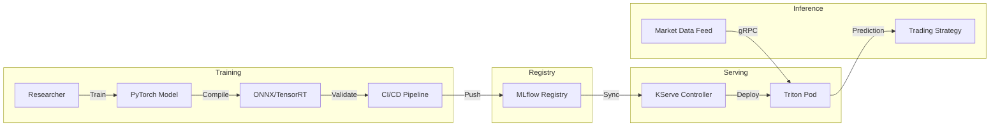

# Specialized Model Deployment

## 1. Architecture

We've built a pipeline for general-purpose LLMs (Task 1) and a pipeline for fine-tuning them (Task 2). But a 70B parameter model is overkill for sentiment analysis, and it's too slow for real-time order book anomaly detection.

In task 3 we outline the deployment of specialized models: small, sharp and fast. We're talking about BERT models for classification, time-series transformers (Chronos/Moirai), and maybe even some XGBoost models wrapped in a modern API.

We cannot load these models into the same heavy vLLM/Ray infrastructure we use for general-purpose LLMs (see Task 1). These models are CPU-friendly (mostly) and need extremely low latency. Because of this, the recommended stack is:

*   **Serving Engine:** **Triton Inference Server**.
    *   Industry standard for non-LLM deep learning. It supports PyTorch, ONNX, and TensorRT backends out of the box.
*   **Model Format:** **ONNX / TensorRT**.
    *  I've seen teams deploy raw PyTorch model.pt files in Flask apps. It works until market open, then the Python GIL chokes, and latency spikes to 500ms. It is better to compile everything to ONNX or TensorRT. It's a pain, but we gain 10x throughput.
*   **Orchestration:** **KServe** (on Kubernetes).

We need a strict contract between the Researchers training these models and the Engineers deploying them:

1.  **Training:** Researcher trains a model.
2.  **Packaging:** The CI pipeline converts it to ONNX and validates numerical precision (did the float16 conversion break the predictions?).
3.  **Registration:** The artifact is pushed to **MLflow Registry** with a strict schema (inputs: text, outputs: logits).
4.  **Deployment:** KServe watches the registry. When a model is tagged prod, it spins up a Triton pod.

## 2. Workflow

## 3. Timeline

| Phase | Duration | Deliverable |
| :--- | :--- | :--- |
| **Phase 1** | Weeks 1-3 | Deploy Triton & MLflow. Create the "PyTorch -> ONNX" conversion scripts. |
| **Phase 2** | Weeks 3-5 | Port one existing "critical path" model (e.g., sentiment) to this new stack. Prove the latency gains. |
| **Phase 3** | Weeks 5-8 | Enable KServe auto-scaling. Integrate with the main trading loop via gRPC. |

## 4. Challenges & Risks

*   **Triton Overhead:** Triton is complex. The config.pbtxt files are verbose and easy to mess up. We need to write a generator script so we never have to touch them.
*   **String Model Versioning:** "Which version of the sentiment model was running during the flash crash?" We need strict logging. Every prediction response must include the model_version in the metadata.
*   **Latency Jitters:** Kubernetes networking adds overhead. For the absolute fastest models, we might need to bypass K8s networking and use host networking or shared memory (if the strategy runs on the same node).
