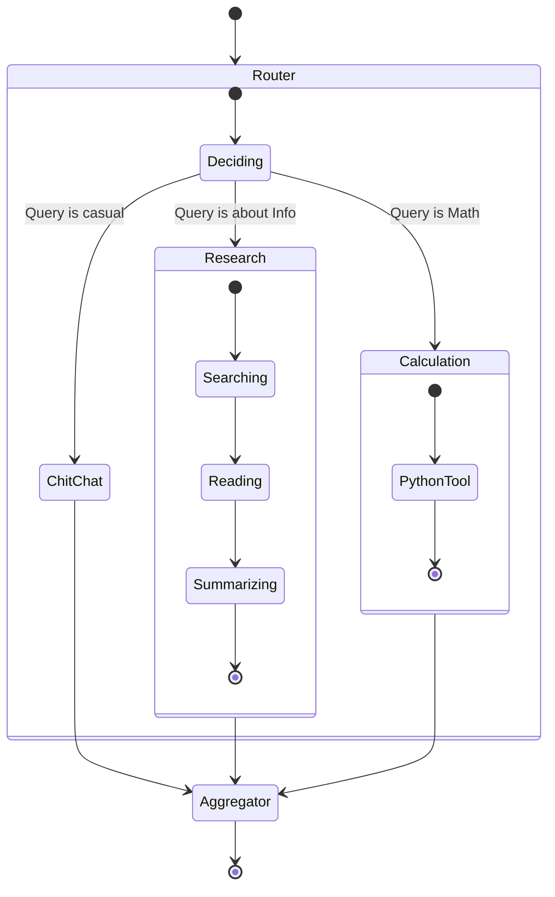

# The Agent SDK

## 1. Architecture
The SDK can be thought of as a set of guardrails to abstract away agentic flows. We are building a **State Machine Engine** where the transitions can be decided by an LLM, but the states are defined by code:

*   **Framework:** **LangGraph**
*   **Data Validation:** **Pydantic**
*   **Tool Protocol:** **Model Context Protocol (MCP)**

## 2. The Developer Experience

We structure the SDK into two layers: **Actions** (what the agent does) and **Workflow Patterns** (how the agent thinks).

### Level 1: Actions
We don't want developers writing raw prompts. They define `Actions` as Python classes.

```python
# The Developer writes this:
class SentimentAnalysis(AgentAction):
    input_schema = NewsArticle
    output_schema = SentimentScore
    
    def instructions(self, data):
        return f"Analyze the sentiment of this article: {data.title}"

# The SDK handles serialization, retries, and token logging automatically.
```

### Level 2: Workflow Patterns
Drawing from industry best practices (Anthropic agent patterns), we provide pre-built abstractions for common cognitive architectures. Developers shouldn't reinvent the "Orchestrator" pattern every time.

#### A. The Chain 
The simplest pattern. Output of A becomes Input of B.
```python
class EarningsPipeline(Workflow):
    def define(self):
        return Chain([
            FetchTranscript(),
            Summarize(max_words=500),
            ExtractMetrics(schema=EarningsMetrics)
        ])
```

#### B. The Router 
Directs traffic based on intent.
```python
class SupportTriage(Workflow):
    def define(self):
        return Router(
            classifier=IntentClassifier(categories=["trade_error", "compliance", "general"]),
            routes={
                "trade_error": TradeDebugFlow(),
                "compliance": ComplianceCheckFlow(),
                "general": GeneralChat()
            }
        )
```

#### C. The Orchestrator-Workers 
A central Orchestrator breaks down a complex task and delegates to Workers.
```python
class DeepResearch(Workflow):
    def define(self):
        return Orchestrator(
            planner=TaskPlanner(prompt="Break this research request into sub-tasks"),
            worker=ResearchAgent(), # Instances spawned dynamically
            aggregator=ReportCompiler()
        )
```

#### D. The Evaluator-Optimizer
The agent generates an output, a Judge evaluates it, and the generator retries. Crucial for code generation.
```python
class SQLGenerator(Workflow):
    def define(self):
        return OptimizerLoop(
            generator=TextToSQL(),
            evaluator=SQLValidator(db_schema=schema),
            max_retries=3,
            threshold=0.9
        )
```

#### E. Human-in-the-Loop
For critical flows that involve business decisions, we can keep humans in the loop:

1. The Agent runs until it reaches a `CriticalDecision` node.
2. It pauses execution and serializes its state to Postgres.
3. A human receives a Slack notification, reviews the proposed action, and clicks "Approve".
4. The Agent resumes exactly where it left off.

## 4. Visualizing a Complex Agent
Here is how a complex "Research & Calculation" agent looks when composed of these patterns:



## 5. Timeline

| Phase | Duration | Deliverable |
| :--- | :--- | :--- |
| **Phase 1** | Weeks 1-3 | Wrap LangGraph with our Pydantic enforcement layer. |
| **Phase 2** | Weeks 3-8 | Build standard tools (SQL Connector, Vector DB Search, Calculator) using the MCP standard. |

## 6. Challenges & Risks

*   **Infinite Loop:** We need strict max_turns limits on every graph execution.
*   **Context Window Pollution:** Agents love to stuff the context with useless history. The SDK needs an automatic Summarizer node that compresses history when it gets too long.
*   **Dependencies:** LangChain/LangGraph updates frequently. We need to pin versions aggressively and wrap their imports so we can swap them out if they break something critical.
